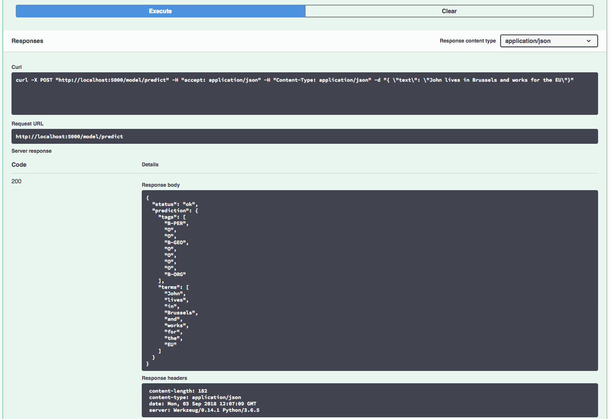

[](https://travis-ci.org/IBM/MAX-Named-Entity-Tagger) [](http://max-named-entity-tagger.max.us-south.containers.appdomain.cloud/)

# IBM Developer Model Asset Exchange: Named Entity Tagger

This repository contains code to instantiate and deploy a named entity recognition model. This model annotates each word or term in a piece of text with a tag representing the entity type, taken from a list of 17 entity tags from the [The Groningen Meaning Bank (GMB) dataset](http://gmb.let.rug.nl/data.php). These tags cover 8 types of named entities: persons, locations, organizations, geo-political entities, artifacts, events, natural objects, time, as well as a tag for 'no entity' (see the [GMB dataset manual page](http://gmb.let.rug.nl/manual.php) for the full entity definitions). The entity types furthermore may be tagged with either a "B-" tag or "I-" tag. A "B-" tag  indicates the first term of a new entity (or only term of a single-term entity), while subsequent terms in an entity will have an "I-" tag. For example, "New York" would be tagged as `["B-GEO", "I-GEO"]` while  "London" would be tagged as `"B-GEO"`.

The model consists of a recurrent neural network architecture with a bi-directional LSTM layer applied to character-level embedding vectors, which are combined with pre-trained [GloVe 6B](https://nlp.stanford.edu/projects/glove/) word vector embeddings; finally a second bi-directional LSTM layer is applied to this combined vector representation. The input to the model is a string and the output is a list of terms in the input text (after applying simple tokenization), together with a list of predicted entity tags for each term.

The model is based on Guillaume Genthial's [Named Entity Recognition with TensorFlow model](https://github.com/guillaumegenthial/sequence_tagging), adapted to use the Keras framework. The model was trained on a subset of the GMB dataset version `2.2.0` by the [IBM CODAIT team](http://codait.org). The model files are hosted on
[IBM Cloud Object Storage](http://max-assets.s3.us.cloud-object-storage.appdomain.cloud/max-named-entity-tagger/assets.tar.gz).
The code in this repository deploys the model as a web service in a Docker container. This repository was developed
as part of the [IBM Code Model Asset Exchange](https://developer.ibm.com/code/exchanges/models/).

## Model Metadata
| Domain | Application | Industry  | Framework | Training Data | Input Data Format |
| ------------- | --------  | -------- | --------- | --------- | -------------- | 
| Natural Language Processing | Named Entity Recognition | General | Keras | [Groningen Meaning Bank (GMB) Dataset](http://gmb.let.rug.nl/data.php) | Text |

*Note* the underlying dataset is primarily based on news articles and so the model should perform relatively better on input related to general news, business, geo-political and sporting events. The dataset covers a period up until 2014, which governs the entities the model will be aware of.

## References

* _G. Lample, M. Ballesteros, S. Subramanian, K. Kawakami, C. Dyer_, ["Neural Architectures for Named Entity Recognition"](https://arxiv.org/pdf/1603.01360), arXiv, 2016.
* _X. Ma and E. Hovy_, ["End-to-end Sequence Labeling via Bi-directional LSTM-CNNs-CRF"](https://arxiv.org/pdf/1603.01354.pdf), arXiv, 2016.
* [Named Entity Recognition with TensorFlow.](https://github.com/guillaumegenthial/sequence_tagging)
* _V. Basile, J. Bos, K. Evang, N. Venhuizen_, ["Developing a large semantically annotated corpus"](http://www.let.rug.nl/bos/pubs/BasileBosEvangVenhuizen2012LREC.pdf), in Proceedings of the
 Eighth International Conference on Language Resources and Evaluation (LREC-2012), pages 3196-3200. European Language Resources Association (ELRA). 2012.
* [GMB dataset about page](http://gmb.let.rug.nl/about.php) and [dataset manual](http://gmb.let.rug.nl/manual.php).
* [stokastik blog resources GitHub repository](https://github.com/funktor/stokastik/blob/master/NER/NER.py).

## Licenses

| Component | License | Link  |
| ------------- | --------  | -------- |
| This repository | [Apache 2.0](https://www.apache.org/licenses/LICENSE-2.0) | [LICENSE](LICENSE) |
| Model Weights |  [Apache 2.0](https://www.apache.org/licenses/LICENSE-2.0) | [LICENSE](LICENSE) |
| Model Code (3rd party) | [Apache 2.0](https://www.apache.org/licenses/LICENSE-2.0) | [TensorFlow NER Repo License](https://github.com/guillaumegenthial/sequence_tagging/blob/master/LICENSE.txt) |

## Pre-requisites:

* `docker`: The [Docker](https://www.docker.com/) command-line interface. Follow the [installation instructions](https://docs.docker.com/install/) for your system.
* The minimum recommended resources for this model is 2GB Memory and 1 CPUs.

# Steps

1. [Deploy from Docker Hub](#deploy-from-docker-hub)
2. [Deploy on Kubernetes](#deploy-on-kubernetes)
3. [Run Locally](#run-locally)

## Deploy from Docker Hub

To run the docker image, which automatically starts the model serving API, run:

```
$ docker run -it -p 5000:5000 codait/max-named-entity-tagger
```

This will pull a pre-built image from Docker Hub (or use an existing image if already cached locally) and run it.
If you'd rather checkout and build the model locally you can follow the [run locally](#run-locally) steps below.

## Deploy on Kubernetes

You can also deploy the model on Kubernetes using the latest docker image on Docker Hub.

On your Kubernetes cluster, run the following commands:

```
$ kubectl apply -f https://github.com/IBM/MAX-Named-Entity-Tagger/raw/master/max-named-entity-tagger.yaml
```

The model will be available internally at port `5000`, but can also be accessed externally through the `NodePort`.

## Run Locally

1. [Build the Model](#1-build-the-model)
2. [Deploy the Model](#2-deploy-the-model)
3. [Use the Model](#3-use-the-model)
4. [Development](#4-development)
5. [Cleanup](#5-cleanup)


### 1. Build the Model

Clone this repository locally. In a terminal, run the following command:

```
$ git clone https://github.com/IBM/MAX-Named-Entity-Tagger.git
```

Change directory into the repository base folder:

```
$ cd MAX-Named-Entity-Tagger
```

To build the docker image locally, run: 

```
$ docker build -t max-named-entity-tagger .
```

All required model assets will be downloaded during the build process. _Note_ that currently this docker image is CPU only (we will add support for GPU images later).


### 2. Deploy the Model

To run the docker image, which automatically starts the model serving API, run:

```
$ docker run -it -p 5000:5000 max-named-entity-tagger
```

### 3. Use the Model

The API server automatically generates an interactive Swagger documentation page. Go to `http://localhost:5000` to load it. From there you can explore the API and also create test requests.

Use the `model/predict` endpoint to post text and get predicted tags from the API. Below are a few example sentences you can use:

```
John lives in Brussels and works for the EU.

Matthew drove to San Francisco on Friday to watch the Golden State Warriors play the Knicks.

Marina works for IBM and lives in London. She supports Chelsea FC.
```



You can also test it on the command line, for example:

```
$ curl -X POST -H 'Content-Type: application/json' -d '{"text":"John lives in Brussels and works for the EU"}' 'http://localhost:5000/model/predict'
```

You should see a JSON response like that below:

```json
{
    "status": "ok",
    "prediction": {
        "entities": [
            "B-PER",
            "O",
            "O",
            "B-GEO",
            "O",
            "O",
            "O",
            "O",
            "B-ORG"
        ],
        "input_terms": [
            "John",
            "lives",
            "in",
            "Brussels",
            "and",
            "works",
            "for",
            "the",
            "EU"
        ]
    }
}
```

### 4. Development

To run the Flask API app in debug mode, edit `config.py` to set `DEBUG = True` under the application settings. You will then need to rebuild the docker image (see [step 1](#1-build-the-model)).

### 5. Cleanup

To stop the Docker container, type `CTRL` + `C` in your terminal.
